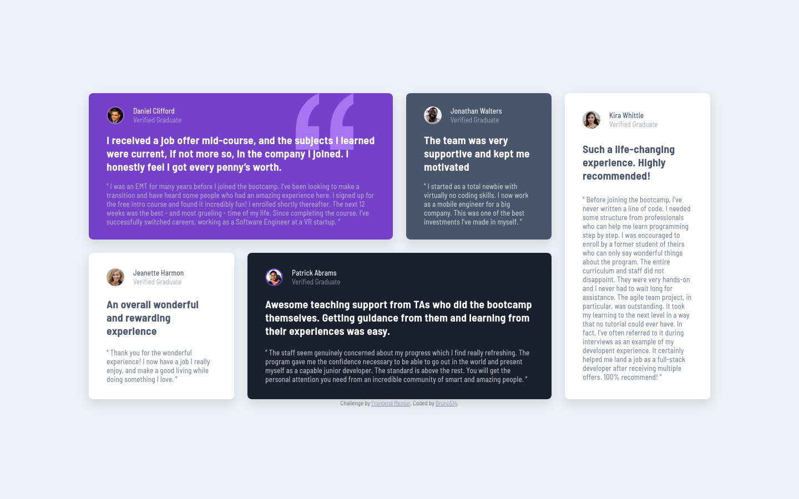

# Frontend Mentor - Testimonials grid section solution

This is a solution to the [Testimonials grid section challenge on Frontend Mentor](https://www.frontendmentor.io/challenges/testimonials-grid-section-Nnw6J7Un7). Frontend Mentor challenges help you improve your coding skills by building realistic projects.

## Table of contents

- [Overview](#overview)
  - [The challenge](#the-challenge)
  - [Screenshot](#screenshot)
  - [Links](#links)
- [My process](#my-process)
  - [Built with](#built-with)
  - [What I learned](#what-i-learned)
  - [Continued Development](#continued-development)
  - [Useful resources](#useful-resources)
- [Author](#author)

## Overview

### The challenge

Users should be able to:

- View the optimal layout for the site depending on their device's screen size

### Screenshot

### Links

- Solution URL: [https://www.frontendmentor.io/solutions/responsive-testimonial-grid-KEnbR76wsU](https://www.frontendmentor.io/solutions/responsive-testimonial-grid-KEnbR76wsU)
- Live Site URL: [https://bruno514.github.io/Testimonials-Grid-Section/](https://bruno514.github.io/Testimonials-Grid-Section/)

## My process

### Built with

- Semantic HTML5 markup
- Flexbox
- CSS Grid
- Mobile-first workflow
- [Sass](https://sass-lang.com/) - CSS Preprocessor

### What I learned

Learning a lot about CSS Grid. Also tried BEM again, and don't feel comfortable using it yet, but I really want to learn more about the methodology.

### Continued development

If possible, I would really aprecciate some feedback on my CSS class naming using BEM. 

### Useful resources

- [BEM](https://getbem.com) - BEM CSS methodology documentation I used.

## Author

- Frontend Mentor - [@Bruno514](https://www.frontendmentor.io/profile/Bruno514)
